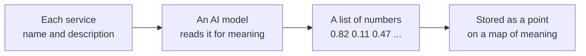
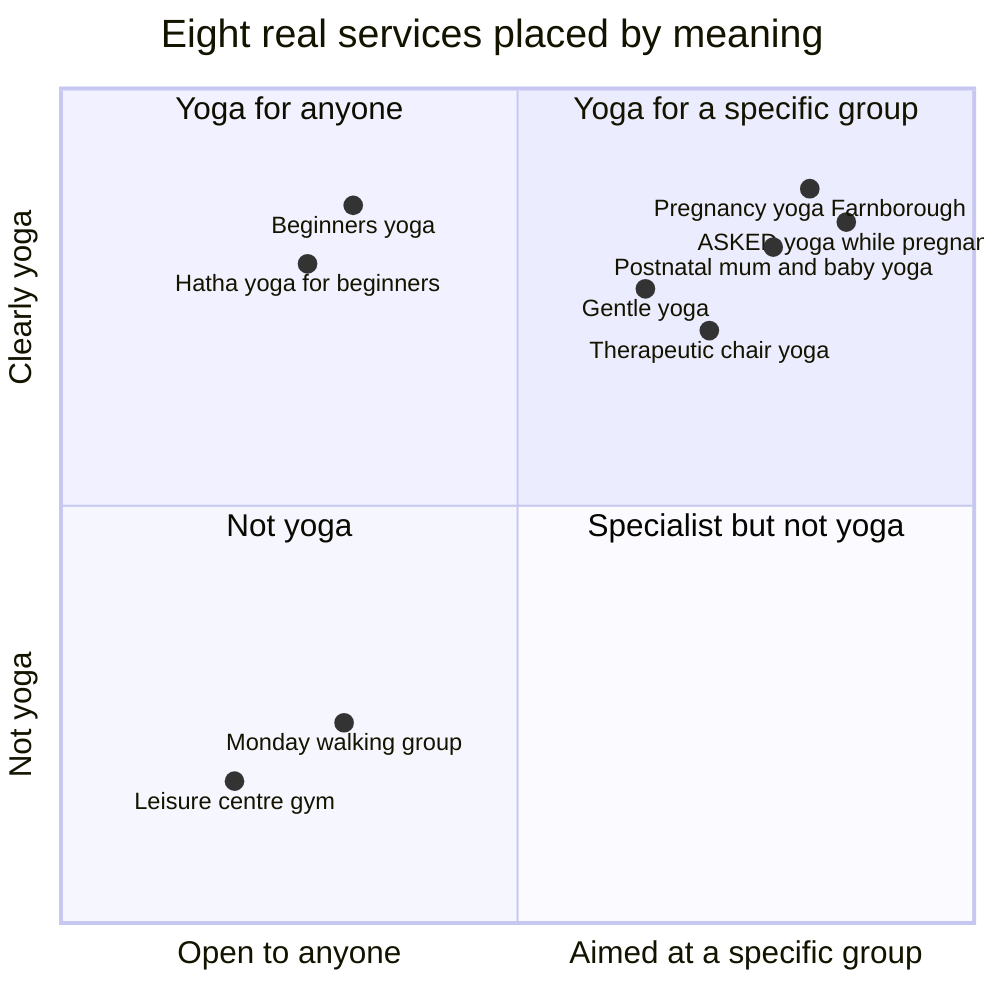
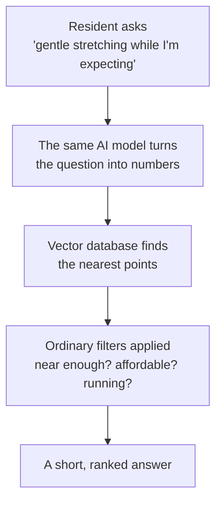

# Vector Search Explained

**Audience:** anyone — no technical background assumed.

This document explains what *embeddings* and a *vector database* are, and why they might be worth adding to an ORUK service directory.  It uses real yoga classes drawn from the live feeds as its worked example.

Everything here is conceptual.  The choice of embedding model and vector store is a separate technical decision and is not covered.

---

## The Problem With Matching Words

Directory search today matches **words**.  A resident types a phrase, and the directory looks for services whose name or description contains those words.

That works when the resident happens to use the same vocabulary as the person who wrote the service description.  It fails when they do not:

| What the resident types | What the directory holds | Result today |
|---|---|---|
| "gentle stretching while I'm expecting" | *Pregnancy Yoga Farnborough* | **Nothing.**  No word in common. |
| "something calm now the baby's here" | *Postnatal Mum & Baby Yoga* | **Nothing.** |
| "exercise I can do sitting down" | *Therapeutic Chair Yoga* | **Nothing.** |

In every case the right service exists, is nearby, and is open.  The resident is simply asking in their own words rather than the directory's words.

Meaning-based search is an attempt to close that gap.

---

## What Gets Stored

Alongside each service's ordinary details — name, address, phone number, opening times — the system stores one extra thing: a long list of numbers.

That list is produced by an AI model that has read the service's name and description.  It is called an **embedding**.

A stored record ends up looking roughly like this:

| What is kept | Example |
|---|---|
| Which feed, which service | Open Sessions, `5f2ff94d-a2c4-4c3c-992d-6996df52f4c0` |
| The text that was read | "Hello And Flow Pregnancy Yoga sessions are unique, revolutionary prenatal yoga classes…" |
| The embedding | `[0.82, 0.11, 0.47, … ]` — typically 384 or 1,536 numbers |
| The ordinary details, unchanged | Farnborough, Wednesdays 18:30, £12.30, ages 18+ |

**The individual numbers mean nothing.**  There is no number for "yoginess" and no number for "suitable in pregnancy".  Only the *distance* between two lists carries meaning: services that mean similar things get similar lists, and therefore sit close together.

That is why it helps to picture the whole directory as a map — one where position represents **meaning** rather than geography.

---

## The Map Of Meaning

Below are eight real services from the ORUK feeds, placed by what they mean.  The final point is not a service at all — it is a resident's question, turned into numbers the same way and dropped onto the same map.

Three things to notice:

1. **The pregnancy and postnatal classes sit together.**  Nobody tagged them as a group; the model placed them there because their descriptions mean similar things.
2. **The leisure centre and the walking group sit far away.**  They are physical activity, but they are not yoga, and the distance shows it.
3. **The question lands in the right neighbourhood**, even though it shares almost no words with the class descriptions.  Answering it is then simply a matter of reading off the nearest few points.

> **Caveat.**  The real map has hundreds of dimensions, not two.  The picture above is a flattening, and the axis labels are a convenience for the reader — in reality the directions have no names.  The groupings shown are a reading of the descriptions, not measured distances.

---

## What A Vector Database Is

A **vector database** is the filing cabinet built for exactly one job: hold millions of these lists of numbers, and answer the question *"what are the twenty nearest points to here?"* in a few thousandths of a second.

That is genuinely all it does.  It is not a replacement for the existing directory database — it sits alongside it, storing only the numbers plus enough of an identifier to look the real record back up.

---

## What Happens When Someone Asks

The fourth step matters as much as the third.  Meaning-matching says nothing about whether a class is **nearby, affordable, accessible, or currently running** — those remain ordinary filters, using the structured ORUK fields the directory already holds.

The realistic design is therefore a combination:

- **Meaning search** answers *"is this the kind of thing they are after?"*
- **Ordinary filters** answer *"can they actually get to it?"*

Neither alone is sufficient.

---

## Honest Limitations

| Limitation | What it means in practice |
|---|---|
| It is confidently approximate | The nearest point is always returned, even when nothing suitable exists.  There is no "no results" unless a distance threshold is imposed. |
| It is only as good as the description | A service with a two-line description is placed vaguely.  Data quality still governs the result. |
| It cannot reason about eligibility | "Is my 15-year-old allowed?" is answered by the age fields, not by meaning. |
| It goes stale | Embeddings must be regenerated whenever a service description changes. |
| It is opaque | You cannot inspect the numbers and explain *why* two services were judged similar. |

---

## The Real Records Used Above

All eight are live records retrieved from the configured feeds.

| On the diagram | Service | Organisation | Feed |
|---|---|---|---|
| Pregnancy yoga Farnborough | Hello And Flow Pregnancy — Pregnancy Yoga Farnborough | YogaBellies Farnborough, Fleet & Camberley | Open Sessions |
| Postnatal mum and baby yoga | Hello And Flow Postnatal — Postnatal Mum & Baby Yoga | YogaBellies Farnborough, Fleet & Camberley | Open Sessions |
| Beginners yoga | Beginners Yoga | The Cambrian Community Centre | Open Sessions |
| Hatha yoga for beginners | Hatha Yoga for Beginners | 1Leisure Medina | Open Sessions |
| Gentle yoga | Gentle Yoga | Stay Zen Yoga | Open Sessions |
| Therapeutic chair yoga | Therapeutic Chair Yoga | Heart Within Yoga | Bristol |
| Leisure centre gym | Bradley Stoke Leisure Centre | Circadian Trust / Active Lifestyles | Bristol |
| Monday walking group | Activities at KWHLC | Knowle West Healthy Living Centre | Bristol |

The Farnborough and Fleet classes are the Hampshire examples.  There is no Hampshire local authority feed in [`feeds.json`](../feeds.json) — they reach the directory through the national **Open Sessions (OpenActive)** feed, which is a useful illustration in its own right of how national feeds fill local gaps.
